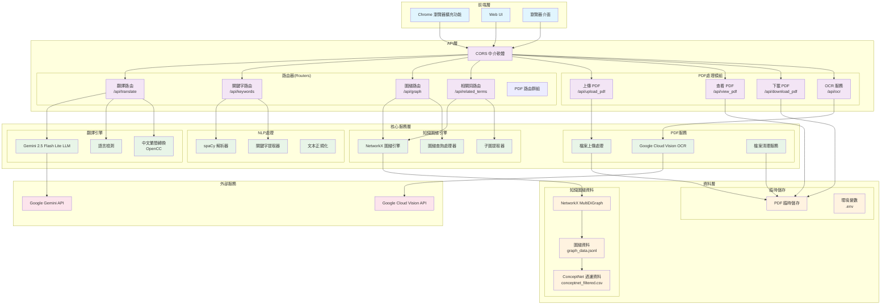
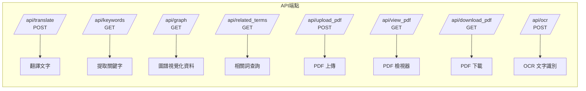
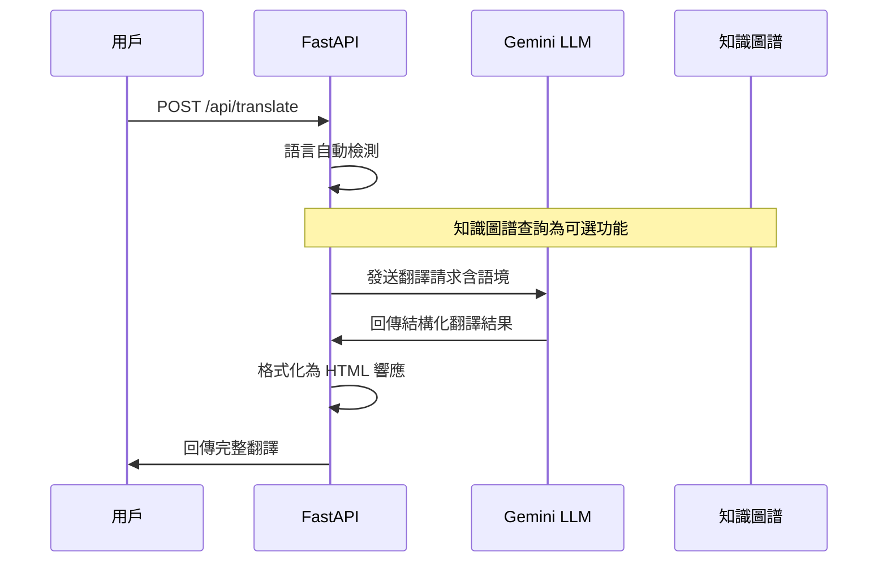
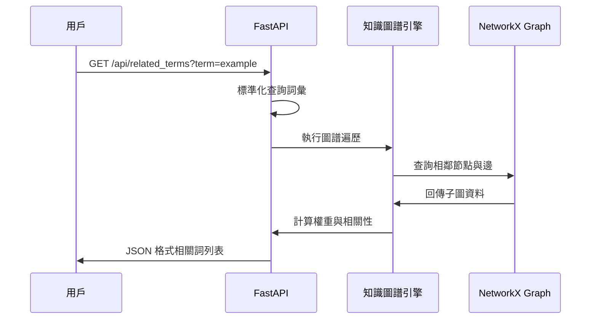
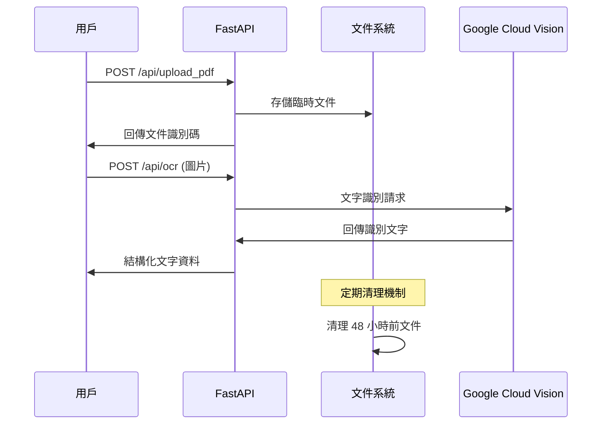
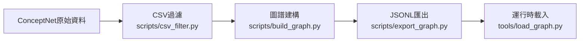

# 後端技術文件

## 1. 系統概述

此後端系統是一個智慧翻譯系統，主要功能為提供高品質的中英文翻譯服務。系統以 Google Gemini AI 為核心翻譯引擎，透過先進的語言模型內建能力提供語境資訊，同時整合 ConceptNet 知識庫作為輔助功能，實現比傳統機器翻譯更準確且富含語境的翻譯結果。

### 1.1 主要功能

- **AI 翻譯引擎**：使用 Google Gemini 2.5 Flash Lite Preview 為主要翻譯引擎，提供高品質中英文翻譯
- **語境感知**：透過 AI 模型內建的語境理解能力，根據上下文調整翻譯策略
- **文件處理**：支援文本翻譯、PDF 文件處理及 OCR 文字識別
- **瀏覽器整合**：提供完整的 API 介面，支援瀏覽器擴充功能
- **知識圖譜輔助**：使用 ConceptNet 知識庫作為輔助資訊，提供詞彙關聯和語意資訊

### 1.2 技術架構概覽

系統採用分層架構設計，包含前端介面層、API 服務層、核心運算層及資料儲存層，確保系統的可擴展性、可維護性及效能最佳化。

## 2. 系統架構設計

### 2.1 整體架構圖



### 2.2 架構層級說明

#### 2.2.1 前端接口層

**Chrome 瀏覽器擴充功能**

- 提供即時網頁文字翻譯功能
- 使用 Chrome Extension API 整合瀏覽器環境
- 透過 CORS 機制與後端 API 進行安全通訊

**Web 用戶介面**

- 提供 PDF 文件檢視器與管理功能
- 支援知識圖譜視覺化展示
- 整合文件上傳、OCR 處理等完整工作流程

#### 2.2.2 API 服務層

**路由管理系統**



**CORS 中介軟體配置**

```python
app.add_middleware(
    CORSMiddleware,
    allow_origins=["*"],  # 支援 Chrome Extension 跨域請求
    allow_credentials=True,
    allow_methods=["*"],
    allow_headers=["*"],
)
```

#### 2.2.3 核心運算層

**翻譯引擎架構**

- **主要 LLM**：Google Gemini 2.5 Flash Lite Preview (gemini-2.5-flash-lite-preview-06-17)，提供精準多語言翻譯
- **語言檢測**：基於正規表達式的中英文自動識別
- **語境理解**：利用 Gemini 模型內建的語境理解能力
- **中文處理**：OpenCC 進行繁體與簡體中文轉換

**知識圖譜引擎**

- **圖譜結構**：使用 NetworkX MultiDiGraph 處理複雜語義關係
- **節點規格**：採用 `/c/{language}/{concept}` 格式（例：`/c/en/cat`、`/c/zh/貓`）
- **關係類型**：支援 ConceptNet 完整關係集合（IsA、UsedFor、RelatedTo 等）
- **查詢最佳化**：實現高效的子圖提取與相關概念推薦算法

**自然語言處理模組**

- **核心工具**：spaCy 自然語言處理框架（en_core_web_sm 模型）
- **處理功能**：詞性標註、實體識別、關鍵字提取
- **多語言支援**：英文與中文文本的完整處理能力

#### 2.2.4 資料存儲層

**知識圖譜資料管理**

- **原始資料**：ConceptNet 多語言知識庫
- **處理管道**：CSV 過濾 → 圖譜建構 → JSONL 序列化
- **運行時載入**：快速圖譜資料載入機制

**文件管理系統**

- **臨時存儲**：PDF 文件暫存機制
- **自動清理**：定時清理過期文件
- **環境配置**：安全的 API 金鑰管理

## 3. 系統工作流程

### 3.1 翻譯處理流程



### 3.2 知識圖譜查詢流程



### 3.3 PDF 處理工作流程



### 3.4 資料建構管道



## 4. API 介面規格

### 4.1 翻譯服務 API

**請求格式**

```http
POST /api/translate
Content-Type: application/json

{
  "text": "hello world",
  "context": "greeting in conversation",
  "pos_en": "noun"
}
```

**回應格式**

```http
HTTP/1.1 200 OK
Content-Type: application/json

{
  "result": "<b>語境翻譯：</b>你好世界<br><b>詳細說明：</b>常見問候語...",
  "normalized_target": "hello world",
  "normalized_pos": "noun"
}
```

### 4.2 知識圖譜 API

**相關詞查詢**

```http
GET /api/related_terms?term=cat&top_k=10&lang=en

Response: [
  {
    "node": "/c/en/cat",
    "relation": "IsA",
    "target": "/c/en/animal",
    "weight": 0.85
  },
  {
    "node": "/c/en/cat",
    "relation": "HasA",
    "target": "/c/en/tail",
    "weight": 0.72
  }
]
```

**關鍵字提取**

```http
GET /api/keywords?text=The quick brown fox jumps

Response: {
  "keywords": ["quick", "brown", "fox", "jumps"],
  "processed_tokens": 5,
  "language": "en"
}
```

### 4.3 PDF 處理 API

**文件上傳**

```http
POST /api/upload_pdf
Content-Type: multipart/form-data

Response: {
  "filename": "temp_20240824_001.pdf",
  "file_size": 2048576,
  "upload_time": "2024-08-24T15:30:00Z",
  "message": "Upload successful"
}
```

**OCR 文字識別**

```http
POST /api/ocr
Content-Type: multipart/form-data

Response: {
  "text": "This is the extracted text from the image...",
  "confidence": 0.95,
  "language_detected": "en"
}
```

## 5. 技術規格與部署

### 5.1 技術棧

**後端核心技術**

- **Web 框架**：FastAPI (Python 3.11-3.12)
- **依賴管理**：Poetry
- **ASGI 伺服器**：Uvicorn
- **異步處理**：支援高併發請求處理

**AI 與機器學習**

- **大型語言模型**：Google Gemini 2.5 Flash Lite Preview (gemini-2.5-flash-lite-preview-06-17)
- **自然語言處理**：spaCy 框架 (en_core_web_sm 模型)
- **光學字符識別**：Google Cloud Vision API
- **語言檢測**：基於正規表達式的中英文檢測模組
- **中文處理**：OpenCC 繁簡轉換引擎

**資料處理與儲存**

- **圖形計算**：NetworkX MultiDiGraph
- **資料格式**：CSV、JSONL 結構化資料
- **中文處理**：OpenCC 繁簡轉換引擎
- **檔案系統**：本地檔案存儲與自動清理機制

### 5.2 系統需求

**運行環境**

- Python 3.11 或以上版本
- 8GB 以上 RAM（推薦 16GB）
- 5GB 可用磁碟空間
- 網路連線（用於 API 調用）

**必要的環境變數與 API 金鑰**

- `GEMINI_API_KEY`：Google Gemini API 金鑰（必需）
- `GCP_CREDENTIALS_JSON` 或 `GOOGLE_APPLICATION_CREDENTIALS`：Google Cloud Vision API 憑證（OCR 功能必需）
- `PDF_FOLDER`：PDF 檔案存放目錄（預設：pdf_files）
- `API_BASE_URL`：API 基礎 URL（預設：http://localhost:8000）

### 5.3 部署配置

**開發環境設定**

```bash
# 安裝相依套件
poetry install

# 下載 spaCy 語言模型
poetry run python -m spacy download en_core_web_sm

# 建構知識圖譜資料
poetry run python -m scripts.csv_filter
poetry run python -m scripts.build_graph
poetry run python -m scripts.export_graph

# 啟動開發伺服器
poetry run uvicorn api.main:app --reload
```

**Docker 容器部署**

```bash
# 建構多平台映像檔
docker build --platform linux/amd64 -t translation-kg:latest .

# 運行容器（注意端口為 8080）
docker run -p 8080:8080 \
  -e GEMINI_API_KEY=$GEMINI_API_KEY \
  -e GCP_CREDENTIALS_JSON='$(cat /path/to/gcp-credentials.json)' \
  -v $(pwd)/uploads:/app/uploads \
  -v $(pwd)/data:/app/data \
  translation-kg:latest
```

**生產環境維護**

```bash
# 自動清理過期 PDF 文件（需確認清理腳本路徑）
0 4 * * * cd /app && python scripts/clean_pdf.py

# 監控系統資源使用
watch -n 1 'ps aux | grep uvicorn'
watch -n 1 'df -h'

# 監控服務狀態
curl -f http://localhost:8080/api/keywords?text="test" || echo "Service down"
```

## 6. 系統特色與優勢

### 6.1 技術創新

**語義增強翻譯**

- 整合大規模語義知識圖譜，提供超越詞彙層面的深度理解
- 利用 Gemini 2.5 Flash Lite 先進語言模型，實現上下文感知的智能翻譯
- 支援概念間關係推理，提升翻譯的準確性與自然度
- 自動語言檢測與詞性標註，提供精確的翻譯結果

**多模態整合**

- 統一處理文字、圖片、PDF 等多種輸入格式
- 無縫整合 OCR 與翻譯流程，實現端到端的文件處理
- 支援瀏覽器擴充功能，提供即時翻譯體驗

### 6.2 系統可靠性

**效能最佳化**

- 採用異步處理架構，支援高併發請求
- 實現圖譜資料的預載入與快取機制
- 智能的資源管理與自動清理功能

**擴展性設計**

- 模組化架構支援功能獨立擴展
- RESTful API 設計便於第三方整合
- 支援容器化部署與水平擴展

**安全性保障**

- 完整的 CORS 配置支援跨域安全存取
- API 金鑰安全管理機制
- 檔案上傳安全性檢查與隔離處理
