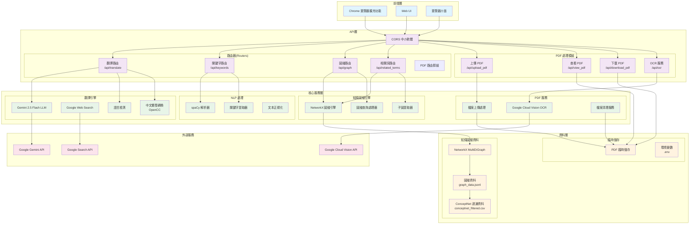
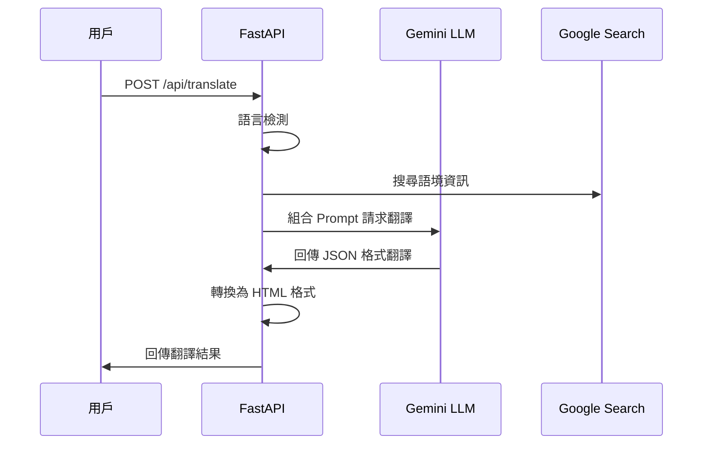
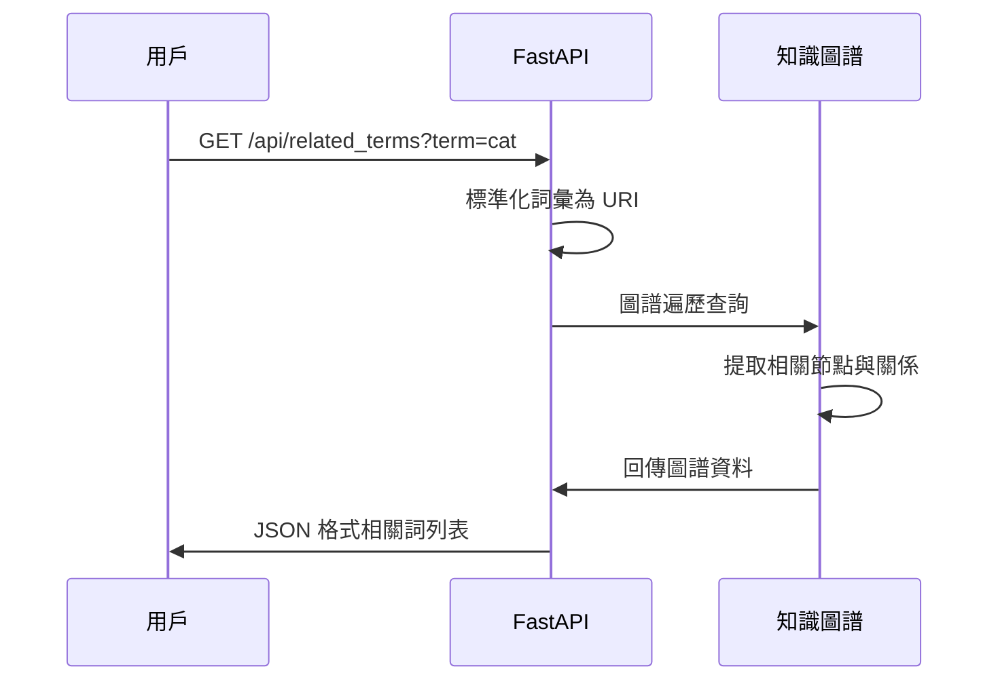
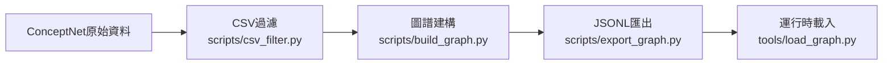

# Translation-KG 系統架構圖

## 系統概覽

Translation-KG 是一個基於知識圖譜的雙語翻譯系統，結合了 ConceptNet 知識圖譜、AI 翻譯服務以及 PDF 處理功能。

## 整體架構



## 詳細架構說明

### 1. 前端層 (Frontend Layer)

#### Chrome 瀏覽器擴充功能
- **功能**: 網頁文字即時翻譯
- **技術**: Chrome Extension API
- **接口**: 透過 CORS 呼叫後端 API
- **主要端點**: `/api/translate`, `/api/keywords`, `/api/related_terms`

#### Web UI / 瀏覽器介面
- **功能**: PDF 檢視器、圖譜視覺化
- **接口**: HTTP REST API
- **支援功能**: 檔案上傳、OCR、圖譜查詢

### 2. API 層 (FastAPI Backend)

#### 主要路由群組

```mermaid
graph LR
    subgraph "API端點"
        A[/api/translate<br>POST] --> A1[翻譯文字]
        B[/api/keywords<br>GET] --> B1[提取關鍵字]
        C[/api/graph<br>GET] --> C1[圖譜視覺化資料]
        D[/api/related_terms<br>GET] --> D1[相關詞查詢]
        E[/api/upload_pdf<br>POST] --> E1[PDF 上傳]
        F[/api/view_pdf<br>GET] --> F1[PDF 檢視器]
        G[/api/download_pdf<br>GET] --> G1[PDF 下載]
        H[/api/ocr<br>POST] --> H1[OCR 文字識別]
    end
```

#### CORS 設定
```python
app.add_middleware(
    CORSMiddleware,
    allow_origins=["*"],  # 支援 Chrome Extension
    allow_credentials=True,
    allow_methods=["*"],
    allow_headers=["*"],
)
```

### 3. 核心服務層 (Core Services)

#### 翻譯引擎
- **主引擎**: Google Gemini 2.5 Flash
- **語言檢測**: 自動識別中英文
- **網路搜尋**: Google Search API 提供語境
- **中文處理**: OpenCC 繁簡轉換

##### 翻譯流程


#### 知識圖譜引擎
- **圖譜結構**: NetworkX MultiDiGraph
- **節點格式**: `/c/{lang}/{term}` (如: `/c/en/cat`, `/c/zh/貓`)
- **關係類型**: ConceptNet 關係 (RelatedTo, IsA, UsedFor 等)
- **查詢功能**: 子圖提取、相關詞推薦

##### 圖譜查詢流程


#### NLP 處理模組
- **工具**: spaCy (en_core_web_sm)
- **功能**: 分詞、詞性標註、關鍵字提取
- **語言支援**: 英文、中文

### 4. 資料層 (Data Layer)

#### 資料建構管道


#### 檔案結構
```
data/
├── conceptnet_filtered.csv    # 過濾後的 ConceptNet 資料
└── graph_data.jsonl          # 序列化圖譜資料

uploads/                      # PDF 臨時存放 (自動清理)
├── temp_*.pdf               # 臨時 PDF 檔案
└── ...

.env                         # 環境變數
├── GEMINI_API_KEY          # Google Gemini API 金鑰
└── ...
```

### 5. 部署與維運

#### Docker 部署
```dockerfile
# 支援多平台建構
docker build --platform linux/amd64 -t lexilight:latest .
```

#### 自動化維運
```bash
# PDF 檔案清理 (Cron Job)
0 4 * * * cd /project/path && python -c "from routers.pdf_manage import clean_old_pdfs; clean_old_pdfs(2)"
```

## API 介面規格

### 翻譯 API
```http
POST /api/translate
Content-Type: application/json

{
  "text": "hello",
  "context": "Hello world",
  "pos_en": "noun"
}

Response:
{
  "result": "<b>情境語意：</b>你好<br>...",
  "normalized_target": "hello",
  "normalized_pos": "noun"
}
```

### 關鍵字提取 API
```http
GET /api/keywords?text=The quick brown fox

Response:
{
  "keywords": ["quick", "brown", "fox"]
}
```

### 圖譜查詢 API
```http
GET /api/related_terms?term=cat&top_k=10

Response: [
  {
    "node": "/c/en/cat",
    "relation": "IsA",
    "target": "/c/en/animal",
    "weight": 0.8
  },
  ...
]
```

### PDF 處理 API
```http
POST /api/upload_pdf
Content-Type: multipart/form-data

Response:
{
  "filename": "temp_xxx.pdf",
  "message": "Upload successful"
}

GET /api/view_pdf?filename=temp_xxx.pdf
Response: HTML PDF Viewer

POST /api/ocr
Content-Type: multipart/form-data

Response:
{
  "text": "Extracted text from image..."
}
```

## 技術棧總結

### 後端核心
- **框架**: FastAPI (Python 3.11-3.12)
- **依賴管理**: Poetry
- **ASGI 伺服器**: Uvicorn

### AI & NLP
- **LLM**: Google Gemini 2.5 Flash
- **NLP**: spaCy
- **OCR**: Google Cloud Vision
- **語言檢測**: 自建模組

### 資料處理
- **圖譜**: NetworkX MultiDiGraph
- **資料格式**: CSV, JSONL
- **中文處理**: OpenCC

### 前端整合
- **CORS**: 支援 Chrome Extension
- **檔案處理**: 臨時儲存 + 自動清理
- **響應格式**: JSON + HTML

這個架構設計確保了系統的可擴展性、效能最佳化以及良好的前後端分離，特別針對瀏覽器擴充功能的跨域需求進行了最佳化配置。
